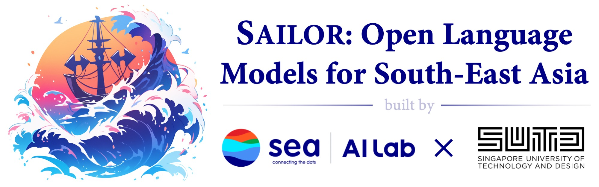

# Sailor: Open Language Models for South-East Asia

[](https://sailorllm.github.io/) &nbsp;&nbsp; [](https://huggingface.co/sail/Sailor-7B)

This repository contains the evaluation and demo code for Sailor, a suite of open language models for South-East Asia. Sailor is developed by the [Sea AI Lab](https://sail.sea.com/) and [Singapore University of Technology and Design](https://istd.sutd.edu.sg/people/faculty/lu-wei/).



## Introduction

Sailor is a suite of Open Language Models tailored for South-East Asia (SEA), focusing on languages such as 🇮🇩Indonesian, 🇹🇭Thai, 🇻🇳Vietnamese, 🇲🇾Malay, and 🇱🇦Lao. Developed with careful data curation, Sailor models are designed to understand and generate text across diverse linguistic landscapes of SEA region. Built from Qwen 1.5, Sailor encompasses models of varying sizes, spanning from 0.5B to 7B versions for different requirements. Benchmarking results demonstrate Sailor's proficiency in tasks such as question answering, commonsense reasoning, reading comprehension and etc. in SEA languages.

- Continually pretrained on 200 Billion to 400 Billion tokens over 7 languages, including Indonesian, Thai, Vietnamese, Malay, Lao, English and Chinese.
- Various model sizes (0.5B, 1.8B, 4B and 7B) to support different requirements.
- Strong performance on SEA benchmarks such as XQuAD, TydiQA, XCOPA, Belebele and M3Exam.
- No restrict on the research and the commercial use, but should comply with the Qwen 1.5 license.

## Models

You can find all the Sailor models in our Huggingface home page [here]([https://huggingface.co/sail](https://huggingface.co/collections/sail/sailor-language-models-65e19a749f978976f1959825)):
- [Sailor-0.5B](https://huggingface.co/sail/Sailor-0.5B)
- [Sailor-1.8B](https://huggingface.co/sail/Sailor-1.8B)
- [Sailor-4B](https://huggingface.co/sail/Sailor-4B)
- [Sailor-7B](https://huggingface.co/sail/Sailor-7B)
- [Sailor-0.5B-Chat](https://huggingface.co/sail/Sailor-0.5B-Chat)
- [Sailor-1.8B-Chat](https://huggingface.co/sail/Sailor-1.8B-Chat)
- [Sailor-4B-Chat](https://huggingface.co/sail/Sailor-4B-Chat)
- [Sailor-7B-Chat](https://huggingface.co/sail/Sailor-7B-Chat) 

## Evaluation

Here are the results of the evaluation of the models on question answering tasks. The evaluation results are presented in the form of tables, where the first column is the model name, and the reset columns are the performance on Thai (th), Indonesian (id), and Vietnamese (vi) languages, respectively. The results of Sailor models are highlighted in bold. You can find the full evaluation results on the different tasks and our evaluation code to reproduce the results in the [eval](eval) directory.

### Question Answering

<table>
<tr>
    <th>3-shot (EM / F1)</th>
    <th>XQuAD (th)</th>
    <th>TydiQA (id)</th>
    <th>XQuAD (vi)</th>
</tr>
<tr>
  <td>Qwen1.5-0.5B</td>
  <td>14.19 / 23.35</td>
  <td>20.71 / 32.64</td>
  <td>19.85 / 35.38</td>
</tr>
<tr>
  <td><b>Sailor-0.5B</b></td>
  <td><b>15.84 / 27.58</b></td>
  <td><b>30.44 / 54.74</b></td>
  <td><b>21.13 / 40.57</b></td>
</tr>
<tr>
  <td>Qwen1.5-1.8B</td>
  <td>27.24 / 43.56</td>
  <td>29.73 / 53.76</td>
  <td>29.17 / 48.15</td>
</tr>
<tr>
  <td><b>Sailor-1.8B</b></td>
  <td><b>32.72 / 48.66</b></td>
  <td><b>40.88 / 65.37</b></td>
  <td><b>34.22 / 53.35</b></td>
</tr>
<tr>
  <td>Qwen1.5-4B</td>
  <td>34.03 / 53.40</td>
  <td>48.32 / 72.68</td>
  <td>43.71 / 63.86</td>
</tr>
<tr>
  <td><b>Sailor-4B</b></td>
  <td><b>46.82 / 63.34</b></td>
  <td><b>53.98 / 73.48</b></td>
  <td><b>47.65 / 67.09</b></td>
</tr>
<tr>
  <td>Llama-2-7b</td>
  <td>30.64 / 43.80</td>
  <td>56.64 / 72.14</td>
  <td>46.96 / 66.16</td>
</tr>
<tr>
  <td>Mistral-7B-v0.1</td>
  <td>48.48 / 63.27</td>
  <td>63.54 / 78.73</td>
  <td>53.72 / 72.75</td>
</tr>
<tr>
  <td>SeaLLM-7b-Hybrid</td>
  <td>49.70 / 67.62</td>
  <td>50.62 / 75.21</td>
  <td>49.62 / 70.74</td>
</tr>
<tr>
  <td>SeaLLM-7b-v2</td>
  <td>34.55 / 55.13</td>
  <td>52.21 / 77.00</td>
  <td>46.19 / 72.11</td>
</tr>
<tr>
  <td>Qwen1.5-7B</td>
  <td>53.79 / 69.30</td>
  <td>57.17 / 77.28</td>
  <td>56.63 / 76.99</td>
</tr>
<tr>
  <td><b>Sailor-7B</b></td>
  <td><b>57.88 / 71.06</b></td>
  <td><b>60.53 / 75.42</b></td>
  <td><b>53.81 / 74.62</b></td>
</tr>
</table>

### Setup

We use [OpenCompass](https://github.com/open-compass/opencompass) to evaluate the models. To install the required packages, run the following command under this folder:

```bash
# setup opencompass environment
conda create --name opencompass python=3.10 pytorch torchvision pytorch-cuda -c nvidia -c pytorch -y
conda activate opencompass
git clone https://github.com/open-compass/opencompass opencompass
cd opencompass
pip install -e .
pip install pythainlp langid
mkdir data
```

### Build Evaluation Script

To build the evaluation script, run the following command under this folder:

```bash
cp -r eval/configs/* opencompass/configs/
cp -r eval/data/* opencompass/data/
cp -r eval/datasets/* opencompass/opencompass/datasets/
cp eval/icl_sailor_evaluator.py opencompass/opencompass/openicl/icl_evaluator/
cp eval/sailor_text_postprocessors.py opencompass/opencompass/utils/
echo "from .icl_sailor_evaluator import AnsEvaluator, TextGenEvaluator  # noqa" >> "opencompass/opencompass/openicl/icl_evaluator/__init__.py"
echo "from .sailor_text_postprocessors import *  # noqa" >> "opencompass/opencompass/utils/__init__.py"
echo "from .xquad import *  # noqa: F401, F403" >> "opencompass/opencompass/datasets/__init__.py"
echo "from .tydiqa_id import *  # noqa: F401, F403" >> "opencompass/opencompass/datasets/__init__.py"
echo "from .xcopa_sea import *  # noqa: F401, F403" >> "opencompass/opencompass/datasets/__init__.py"
echo "from .m3exam import *  # noqa: F401, F403" >> "opencompass/opencompass/datasets/__init__.py"
echo "from .belebele import *  # noqa: F401, F403" >> "opencompass/opencompass/datasets/__init__.py"
cp eval/eval_sailor.py opencompass/configs/
```

### Run Evaluation

To run the evaluation, run the following command under this folder:

```bash
cd opencompass
python run.py configs/eval_sailor.py -w outputs/sailor --num-gpus 1 --max-num-workers 64
```

You can also modify the script to evaluate other models like Qwen1.5, Llama, Mistral, etc.


## Demo

We provide a simple [demo](https://huggingface.co/spaces/sail/Sailor-7B-Chat) to chat with Sailor-7B-Chat. You can find the [demo code](https://github.com/sail-sg/sailor-llm/tree/main/demo).

## Citing this work

If you use this repository or sailor models you can cite

```
@misc{Sailor,
  title = {Sailor: Open Language Models for South-East Asia},
  author = {Longxu Dou and Qian Liu and Guangtao Zeng and Jia Guo and Jiahui Zhou and Wei Lu and Min Lin},
  year = {2024},
  url={https://github.com/sail-sg/sailor-llm}
}
```

## Contact

If you have any questions, please raise an issue in our Github or contact us at <a href="mailto:doulx@sea.com">doulx@sea.com</a> and <a href="mailto:liuqian@sea.com">liuqian@sea.com</a>.
